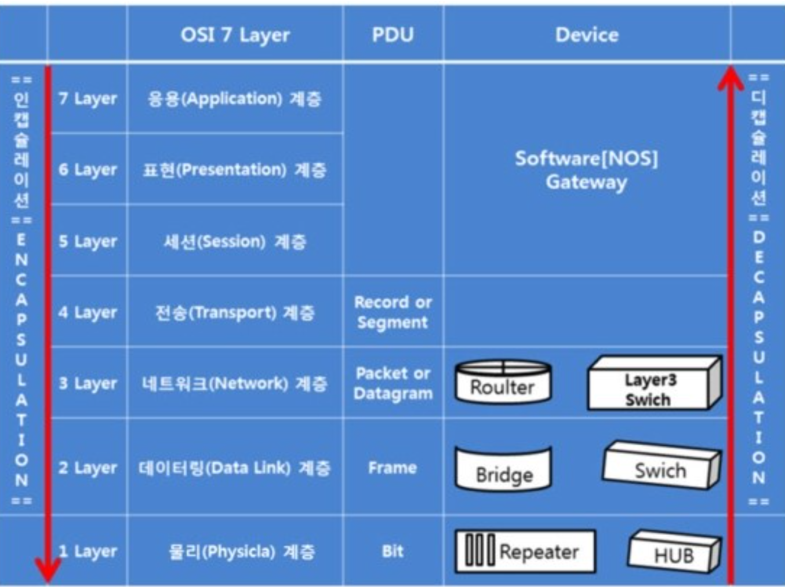
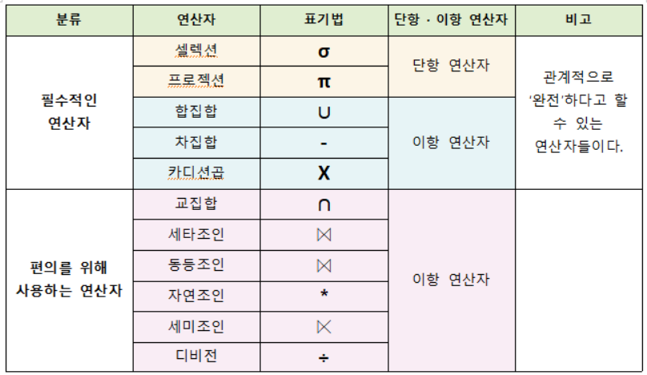
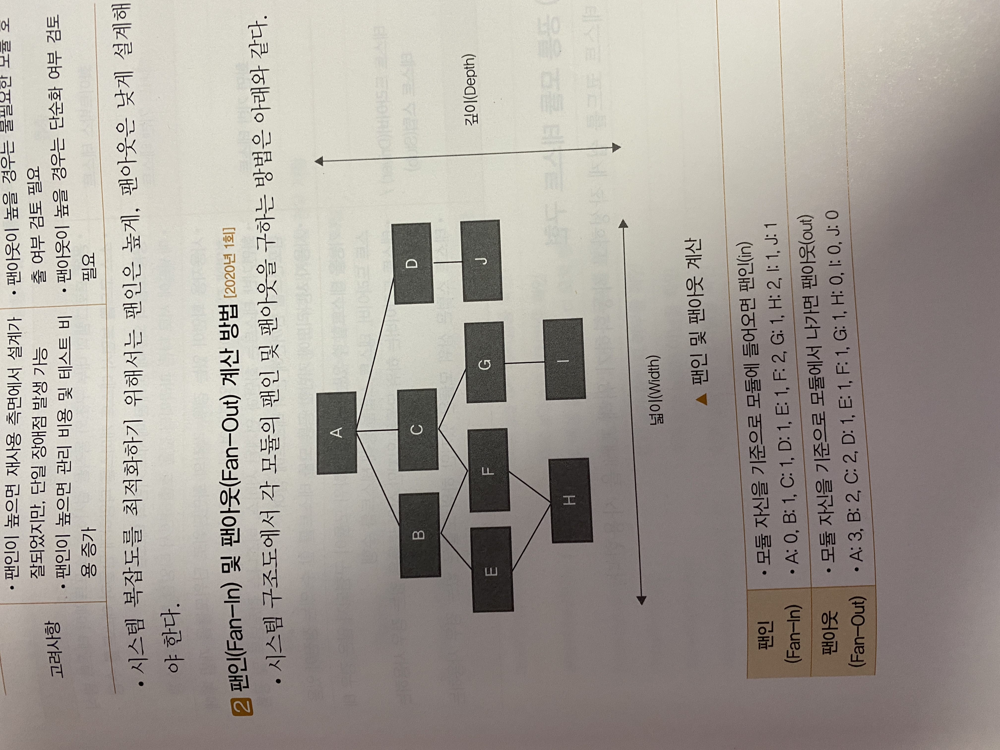

## 소프트웨어 생명주기란

소프트웨어 생명주기는 시스템의 요구 분석부터 유지보수까지 전 공정을 체계화한 절차이다.

## 소프트웨어 생명주기 모델 프로세스

요구사항 분석 -> 설계 -> 구현 -> 테스트 -> 유지보수

## 소프트웨어 생명주기 모델 종류

1. 폭포수

   1. 타당성 검토 -> 계획 -> 요구사항 분석 -> 설계 -> 구현 -> 테스트 -> 유지보수

2. 프로토타이핑

3. 나선형

   1. 계획 및 정의 -> 위험 분석 -> 개발 -> 고객 평가 

      계위개고

4. 반복적

**폭 프 나 반**

## 소프트웨어 개발방법론 개념

소프트웨어 개발 전 과정에서 지속적으로 적용할 수 있는 방법, 절차, 기법 이다.

## 소프트웨어 개발방법론 종류

1. 구조적 방법론
2. 정보공학 방법론
3. 객체지향 방법론
4. 컴포넌트 기반 방법론
5. 애자일 방법론
6. 제품 계열 방법론

## 애자일 개념

절차보다는 사람이 중심이 되어 변화에 유연하고 신속하게 적응하면서 효율적으로 시스템을 개발할 수 있는개발 방법론

## 애자일 방법론의 유형

XP, 린 , 스크럼

## 델파이 기법이란

전문가의 경험적 지식을 통한 문제 해결 및 미래예측을 위한 기법

## 비용산정 모형 개념이란

소프트웨어 규모파악을 통한 투입자원, 소요시간을 파악하여 실행 가능한 계획을 수립하기 위해 비용을 산정하는 방식

## 비용 산정 모형 종류

1. LoC(Lines of Code)

   각 기능의 원시 코드 라인 수의 낙관치, 중간치, 비관치를 측정하여 예측치를 구하고 이를 이용하여 비용을 산정하는 방식

   - 비관치 : 가장 많이 측정된 코드 라인 수
   - 중간치 : 측정된 모든 코드 라인 수의 평균
   - 낙관치 : 가장 적게 측정된 코드 라인 수
   - (비관치 + 4중간치 + 낙관치) / 6

2. Man Month 모형

   한 사람이 1개월 동안 할 수 있는 일의 양을 기준으로 프로젝트 비용을 산정

   - Man Month = (Loc)/(프로그래머의 월간 생산성)
   - 프로젝트 기간 = (Man Month)/(프로젝트 인력)

3. COCOMO 모형

   보헴이 제안한 모형으로 프로그램 규모에 따라 비용을 산정하는 방식

   - 조직형 :5만 라인 이하의 소프트웨어 개발 할 때
   - 반 분리형 : 30만 라인 이하의 소프트웨어 개발 할 때
   - 임베디드형 : 30만 라인 이상 소프트웨어 개발 할 때

4. 푸트남 모형

   소프트웨어 개발주기의 단계별로 요구할 인력의 분포를 가정하는 방식

5. 기능점수 모형

   요구 기능을 증가시키는 인자별로 가중치를 부여하고, 요인별로 가중치를 합산하여 총 기능의 점수를 계산하여 비용을 산정하는 방식

   기능점수 = 총 기능점수 X [0.65 + (0.1 x 총 영향도)]


## 일정관리 모델 종류

- CPM(주 공정법)
  - **여러 작업의 수행 순서가 얽혀 있는 프로젝트의 일정을 계산하는 기법**
  
    
- PERT
  - **일의 순서를 계획적으로 정리하기 위한 수렴 기법으로 비관치, 중간치, 낙관치의 3점 추정방식을 통해 일정관리 기법**
- CCPM(중요 연쇄 프로젝트 관리)
  - **자원제약사항을 고려하여 일정을 작성하는 기법**


## 현행 시스템 파악이란

현행 시스템이 어떤 하위 시스템으로 구성되어 있고, 제공 기능 및 연계 정보는 무엇이며, 어떤 기술 요소를 사용하는지 파악하는 활동


## ‼️ 현행 시스템 파악 절차

1. **구성/기능/인터페이스 파악**
2. **아키텍처 및 소프트웨어 구성 파악**
3. **하드웨어 및 네트워크 구성 파악**


## 소프트 아키텍처란

여러가지 소프트웨어 구성요소와 그 구성요소가 가진 특성 중에서 외부에 드러나는 특성, 그리고 구성요소 간의 관계를 표현하는 시스템의 구조나 구조체


## 소프트 아키텍처 프레임 워크란

소프트웨어 집약적인 시스템에서 아키텍처가 표현해야 하는 내용 및 이들 간의 관계를 제공하는 아키텍처 기술 표준


## ‼️소프트웨어 아키텍처 4+1 뷰란

고객의 요구사항을 정리해 놓은 시나리오를 4개의 관점에서 바라보는 소프트웨어적인 접근 방법이다. (유스케이스 사용)


### 소프트웨어 아키텍처 1 구성 요소

- 유스케이스 뷰

### 소프트웨어 아키텍처 4 구성 요소

- 논리 뷰
- 프로세스 뷰
- 구현 뷰
- 배포 뷰


**유논프구배**


## 소프트웨어 아키텍처 패턴이란

소프트웨어를 설계할 때 참조할 수 있는 전형적인 해결 방식

- 계층화 패턴
  - 시스템을 계층으로 구분하여 구성하는 패턴
- 클라이언트-서버 패턴
  - 하나의 서버와 다수의 클라이언트로 구성된 패턴
- 파이프-필터 패턴
  - 데이터 스트림을 생성하고 처리하는 시스템에서 사용가능한 패턴
- 브로커 패턴
  - 분리된 컴포넌트들로 이루어진 분산 시스템에서 사용되고, 이 컴포넌트들은 원격 서비스 실행을 통해 상호작용이 가능한 패턴
- MVC 패턴
  - 모델 뷰 컨트롤러 3개의 서브 시스템으로 구조화 하는 패턴 


## 디자인 패턴 이란

소프트웨어 설계에서 공통으로 발생하는 문제에 대해 자주 쓰이는 설계 방법을 정리한 패턴


## 디자인 패턴의 유형

- 생성 
  - 객체 인스턴스 생성에 관여, 클래스의 정의와 객체 생성 방식을 구조화, 캡슐화를 수행하는 패턴
- 구조 
  - 더 큰 구조 형성 목적으로 클래스나 객체의 조합을 다루는 패턴 
- 행위
  - 클래스나 객체들이 상호작용하는 방법과 역할 분담을 다루는 패턴

**생구행**


- 생성패턴
  - 빌더
  - 프로토타입
  - 팩토리 메서드
  - 추상 팩토리
  - 싱글톤

생빌 프로 팩앱싱

- 구조패턴
  - 브릿지
  - 데코레이터
  - 퍼사드
  - 플라이 웨이트
  - 프록시
  - 컴포지트
  - 어댑터

구 브데 퍼플 프록 컴 어

- 행위패턴
  - 메디에이터
  - 인터프리터
  - 이터레이터
  - 템플릿 메서드
  - 옵저버
  - 스테이트
  - 비지터
  - 커맨드
  - 스트렛지
  - 모멘토
  - 책임연쇄패턴


## 운영체제란

컴퓨터 시스템이 제공하는 모든 하드웨어, 소프트웨어를 사용할 수 있도록 해주고 컴퓨터 사용자와 컴퓨터 하드웨어 간의 인터페이스를 담당하는 프로그램 


## 운영체제 종류 및 특징


| 구분   | 종류       | 저작자         | 특징                                            |
| ------ | ---------- | -------------- | ----------------------------------------------- |
| PC     | 윈도우     | Microsoft      | 중/소규모 서버, 일반 PC 등 유지, 관리 비용 장점 |
|        | 유닉스     | IBM ,HP , SUN  | 대용량 처리, 안정성 높은 엔터프라이즈급 서버    |
|        | 리눅스     | Linus Torvalds | 중/대규모 서버 대상, 높은 보안성 제공           |
| 모바일 | 안드로이드 | 구글           | 귀찮                                            |
|        | IOS        | 애플           | 귀찮                                            |


## 네트워크 개념

컴퓨터 장치들의 노드 간 연결을 사용하여 서로에게 데이터를 교환할 수 있도록 하는 기술


## OSI 7 계층 




## DBMS 개념

데이터베이스라는 데이터의 집합을 만들고, 저장 및 관리할 수 있는 기능들을 제공하는 프로그램 


## DBMS의 기능 

- 중복제어
- 접근통제
- 인터페이스제공
- 관계표현
- 샤딩/파티셔닝
- 무결성 제약조건
- 백업 및 회복

## DBMS 현행 시스템 분석시 고려 사항

- 가용성
- 성능
- 상호 호환성
- 기술 지원
- 구축 비용


## 미들웨어 개념

분산 컴퓨팅 환경에서 응용 프로그램과 프로그램이 운영되는 환경 간에 원만한 통신이 이루어질 수 있도록 제어해주는 소프트웨어


## WAS 란 

서버 계층에서 애플리케이션이 동작할 수 있는 환경을 제공하고 안정적인 트랜잭션 처리와 관리, 다른 이 기종 시스템과의 애플리케이션 연동을 지원하는 서버


## 요구 공학 개념

사용자의 요구가 반영된 시스템을 개발하기 위하여 사용자 요구사항에 대한 도출, 분석, 명세, 확인 및 검증하는 구조화된 활동


## 요구사항 분류

- 기능적 요구사항
  - 시스템이 제공하는 기능, 서비스에 대한 요구사항 
- 비기능적 요구사항
  - 시스템이 수행하는 기능 이외의 사항, 시스템 구축에 대한 제약사항에 관한 요구사항


## 요구사항 개발 단계 구성

도출 -> 분석 -> 명세 -> 확인


(도분명확)


## 요구사항 도출 단계

소프트웨어가 해결해야 할 문제를 이해하고 고객으로부터 제시되는 추상적 요구에 대해 관련 정보를 식별하고 수집 방법 결정, 수집된 요구사항을 구체적으로 표현하는 단계이다.

- 인터뷰
- 브레인스토밍
- 델파이기법
- 롤 플레잉
- 워크숍
- 설문 조사


## UI 설계 원칙 (2번 출제됨)

- 직관성
  - 누구나 쉽게 이해하고 쉽게 사용할 수 있어야 함
- 유효성
  - 정확하고 완벽하게 사용자의 목표가 달성될 수 있도록 제작
- 학습성
  - 초보자와 숙련자 모두가 쉽게 배우고 사용할 수 있게 제작
- 유연성
  - 사용자의 요구사항을 최대한 수용하고, 실수를 방지할 수 있도록 제작

직유학유

## UML의 개념

객체지향 소프트웨어 개발 과정에서 산출물을 명세화, 시각화, 문서화 할때 사용되는 모델링 기술과 방법론을 통합해서 만든 표준화된 범용 모델링 언어


## UML의 특징

- 가시화언어
  - 개념 모델 작성 시 오류가 적고 의사소통이 용이
- 구축언어
  - 다양한 프로그래밍 언어로 실행 시스템의 예측 가능
- 명세화언어
  - 정확한 모델 제시, 완전한 모델 작성 가능
- 문서화언어
  - 시스템에 대한 평가 및 의사소통의 문서


## UML의 구성 요소

- 사물
- 관계
- 다이어그램


## 클래스 다이어그램

클래스 다이어그램은 객체지향 모델링시 클래스의 속성 및 연산과 클래스 간 정적인 관계를 표현한 다이어그램 


## 유스케이스 다이어그램

시스템이 제공하고 있는 기능 및 그와 관련된 외부 요소를 사용자와 관점에서 표현하는 다이어그램


## 시퀀스 다이어그램

시퀀스 다이어그램은 객체 간 상호작용을 메시지 흐름으로 표현한 다이어그램


## 패키지 다이어그램

시스템의 서로 다른 패키지들 사이의 의존 관계를 표현하기 위한 다이어그램


## 활동 다이어그램

시스템이 어떤 기능을 수행하는지를 객체의 처리 로직이나 조건에 따른 처리의 흐름을 순서대로 표현하는 다이어그램


## 상태 다이어그램

하나의 객체가 자신이 속한 클래스의 상태 변화 혹은 다른 객체와의 상호작용에 따라 상태가 어떻게 변화하는지 표현하는 다이어그램


## 커뮤니케이션 다이어그램

시퀀스 다이어그램과 같이 동작에 참여하는 개체들이 주고받는 메시지를 표현하고, 메세지뿐만 아니라 객체간의 연관까지 표현하는 다이어그램


## 컴포넌트 다이어그램

시스템을 구성하는 물리적인 컴포넌트와 그들 사이의 의존 관계를 나타내는 다이어그램


## 데이터 모델

데이터 모델은 현실 세계의 정보를 인간과 컴퓨터가 이해할 수 있도록 추상화하여 표현한 모델


## 데이터 모델 절차

- 개념적 데이터 모델
  - 현실 세계에 대한 인식을 추상적, 개념적으로 표현하여 개념적 구조를 도출하는 데이터 모델
- 논리적 데이터 모델
  - 업무의 모습을 모델링 표기법으로 형상화하여 사람이 이해하기 쉽게 표현한 데이터 모델
- 물리적 데이터 모델
  - 논리 데이터 모델을 특정 DBMS의 특성 및 성능을 고려하여 물리적인 스키마를 만드는 일련의 데이터 모델


## 관계형 데이터 모델

데이터를 행과 열로 구성된 2차원 테이블 형태로 구성한 모델

수학자 E.F.Godd박사가 제안한 모델


## 관계 데이터 모델의 구성

| 구성요소   | 설명                                                         |
| ---------- | ------------------------------------------------------------ |
| 릴레이션   | 행과 열로 구성된 테이블                                      |
| 튜플       | 릴레이션의 행에 해당하는 요소                                |
| 속성       | 릴레이션의 열에 해당하는 요소                                |
| 카디널리티 | 튜플의 수                                                    |
| 차수       | 애트리뷰트의 수                                              |
| 스키마     | 데이터베이스 구조, 제약조건 등의 정보를 담고 있는 기본적인 구조 |
| 인스턴스   | 정의된 스키마에 따라 생성된 테이블에 실제 저장된 데이터의. 집합 |


## 관계 대수

관계형 데이터베이스에서 원하는 정보와 그 정보를 어떻게 유도하는가를 기술하는 절차적 정형 언어


## 관계 대수 연산자의 종류



**일반 연산자 **

합집합,교집합,차집합,카딕션 프로덕트

**순수 관계 연산자**

셀렉트,프로젝트,조인,디비전


## 관계 해석

튜플 관계 해석과 도메인 관계 해석을 하는 비절차적 언어


## 논이 데이터 모델링 속성

- 개체
  - 관리할 대상이 되는 실체
- 속성
  - 관리할 정보의 구체적 항목
- 관계
  - 개체 간의 대응 관계

## 개체-관계 (E-R) 모델

E-R모델은 현실 세계에 존재하는 데이터와 그들 간의 관계를 사람이 이해할 수 있는 형태로 명확하게 표현하기 위해서 가장 널리 사용되고 있는 모델


## 정규화

관계형 데이터 모델에서 데이터의 중복성을 제거하여 이상 현상을 방지하고, 데이터의 일관성과 정확성을 유지하기 위해 무손실 분해하는 과정 


## 이상 현상

이상 현상은 데이터의 중복성으로 인해 릴레이션을 조작할 때 발생하는 비합리적인 현상


## 이상 현상의 종류

- 삽입 이상
  - 정보 저장 시 해당 정보의 부필요한 세부정보를 입력해야 하는 경우
- 삭제 이상
  - 정보 삭제 시 원치 않는 다른 정보가 같이 삭제되는 경우
- 갱신 이상
  - 중복 데이터 중에서 특정 부분만 수정되어 중복된 값이 모순을 일으키는 경우


## 정규화 단계

원부이 결다조

- 1정규화(1NF)
  - 원자값으로 구성
- 2정규화(2NF)
  - 부분 함수 종속 제거
- 3정규화(3NF)
  - 이행 함수 종속 제거
- 보이스코드 정규화(BCNF)
  - 결정자 후보 키가 아닌 함수 종속 제거
- 4정규화(4NF)
  - 다치 종속 제거
- 5정규화(5NF)
  - 조인 종속 제거


## 반 정규화

정규화된 엔티티, 속성, 관계에 대해 성능 향상과 개발 운영의 단순화를 위해 중복, 통합, 분리 등을 수행하는 데이터 모델링의 기법


## 반 정규화의 특징

- 장점 
  - 성능 향상과 관리의 효율성이 증가
- 단점
  - 데이터의 일관성 및 정합성 저하


## 물리 데이터 모델링

논리모델을 적용하고자 하는 기술에 맞도록 상세화 하는 과정


## 인덱스

검색 연산의 최적화를 위해 데이터베이스 내 열에 대한 정보를 구성한 데이터구조


## 데이터베이스

다수의 인원, 시스템 또는 프로그램이 사용할 목적으로 통합하여 관리되는 데이터의 집합


## 데이터베이스의 특성

- 실시간 접근성
  - 쿼리에 대하여 실시간 응답이 가능해야 함
- 계속적인 변화
  - 새로운 데이터의 삽입, 삭제, 갱신으로 항상 최신의 데이터를 유지함
- 동시 공용
  - 다수의 사용자가 동시에 같은 내용의 데이터를 이용할 수 있어야함
- 내용 참조
  - 데이터베이스에 있는 데이터를 참조할 때 데이터 ㄹㅔ코드의 주소나 위치에 의해서가 아니라 사용자가 요구하는 데이터 내용으로 데이터를 찾는다.


## DBMS

DBMS는 데이터 관리의 복잡성을 해결하는 동시에 데이터 추가, 변경, 검색, 삭제 및 백업, 복구 ,보안 등의 기능을 지원하는 소프트웨어


## DBMS의 유형 

- 키 값 DBMS
  - 키 기반 GET / PUT / Delete 제공. 메모리 기반에서 성능 우선 시스템 및 빅데이터 처리 가능 DBMS
  - Unique 한 키 하나의 값을 가지고 있는 형태
  - Redis, DynamoDB
- 컬럼 기반 데이터 저장
  - Key 안에 조합으로 된 여러 개의 필드를 갖는  DBMS 
  - 테이블 기반, 조인 미지원, 컬럼 기반으로 구글의 Bigtable 기반으로 구현
  - HBase, Cassandra
- 문서 저장
  - 값의 데이터 타입이 문서라는 타입으로 사용하는 DBMS
  - 문서 타입은 XML, JSON과 같이 구조화된 데이터 타입으로, 복잡한 계층 구조 표현 가능
  - MongoDB Couchbase
- 그래프
  - 시맨틱 웹과 온톨로지 분야에서 활용되는 그래프로 데이터를 표현하는 DBMS
  - 노드와 엣지로 특징되는 요소 특화
  - 노드 간 관계를 구조화하여 저장
  - Neo4j, AllegroGraph


## DBMS의 특징

- 데이터 무결성
  - 부적절한 자료가 입력되어 동일한 내용에 대하여 서로 다른 데이터가 저장되는 것을 허용하지 않는 성질
- 데이터 일관성
  - 삽입, 삭제, 갱신, 생성 후에도 저장된 데이터가 변함없이 일정
- 데이터 회복성
  - 장애가 발생하였을 시 특정 상태로 복구되어야 하는 성질
- 데이터 보안성
  - 불법적인 노출, 변경, 손실로부터 보호되어야 하는 성질
- 데이터 효율성
  - 응답 시간, 저장 공간 활용 등이 최적화되어 사용자, 소프트웨어, 시스템 등의 요구 조건을 만족시켜야 하는 성질

무일회보효 

## 빅데이터

시스템,서비스,조직 등에서 주어진 비용, 시간 내에 처리 가능한 데이터 범위를 넘어서는 수십 페타바이트 크기의 비정형 데이터


## NoSQL

데이터 저장에 고정된 테이블 스키마가 필요하지 않고 조인 연산을 사용할 수 없으며, 수평적으로 확장이 가능한 DBMS


## NoSQL의 특성

- Basically Available
  - 언제든지 데이터는 접근할 수 있어야 하는 속성
  - 분산 시스템이기 때문에 항상 가용성 중시
- Soft-State
  - 노드의 상태는 내부에 포함된 정보에 의해 결정되는 것이 아니라 외부에서 전송된 정보를 통해 결정되는 속성
  - 특정 시점에서는 데이터의 일관성이 보장되지 않음
- Eventually Consistency
  - 일정 시간이 지나면 데이터의 일관성이 유지되는 속성
  - 일관성을 중시하고 지향 


## 데이터 마이닝

대규모 저장된 데이터 안에서 체계적이고 자동적으로 통계적 규칙이나 패턴을 찾아내는 기술


## 데이터 마이닝 주요 기법

- 분류 규칙
  - 과거 데이터로부터 특성을 찾아내어 분류모형을 만들어 이를 토대로 새로운 레코드의 결과 값을 예측하는 기법
- 연관 규칙
  - 데이터 안에 존재하는 항목들 간의 종속관계를 찾아내는 기법
- 연속 규칙
  - 연관 규칙에 시간 관련 정보가 포함된 형태의 기법
- 데이터 군집화
  - 대상 레코드들을 유사한 특성을 지닌 몇 개의 소그룹으로 분할하는 작업으로 작업의 특성이 분류규칙과 유사


## EAI(Enterprise Application Integration)

기업에서 운영되는 서로 다른 플랫폼 및 애플리케이션 간의 정보를 전달, 연계, 통합이 가능하도록 해주는 솔루션


## EAI 구성 요소

- EAI 플랫폼
  - 이 기종 시스템 간 애플리케이션 상호 운영
- 어댑터
  - 다양한 패키지 애플리케이션 및 기업에서 자체적으로 개발한 애플리케이션을 연결하는 EAI의 핵심 장치로 데이터 입출력 도구
- 브로커
  - 시스템 상호 간 데이터가 전송될 때, 데이터 포맷과 코드를 변환하는 솔루션
- 메세지 큐
  - 비동기 메시지를 사용하는 다른 응용 프로그램 사이에서 데이터를 송수신하는 기술
- 비즈니스 워크플로우
  - 미리 정의된 기업의 비즈니스 Workflow에 따라 업무를 처리하는 기능


## EAI 구축 유형

- 포인트 투 포인트

  - 가장 기초적인 애플리케이션 통합방법으로 1:1 단순 통합 방법

- 허브 앤 스포크

  - 단일한 접점의 허브 시스템을 통하여 데이터를 전송하는 중앙 집중식 방식

- 메시지 버스

  - 애플리케이션 사이 미들웨어를 두어 연계하는 미들웨어 통합 방식

- 하이브리드

  - 그룹 내는 허브 앤 스포크 방식을 사용하고, 그룹 간에는 메시지 버스 방식을 사용하는 통합 방식

    

    

    포허 메하


## ESB

기업에서 운영되는 서로 다른 플랫폼 및 애플리케이션들 간을 하나의 시스템으로 관리 운영할 수 있도록 서비스 중심의 통합을 지향하는 아키텍처


## 웹서비스

웹 서비스는 네트워크에 분산된 정보를 서비스 형태로 개방하여 표준화된 방식으로 공유하는 기술로써 서비스 지향 아키텍처 개념을 실현하는 대표적인 기술


## 웹 서비스 유형 

- SOAP
  - HTTP, HTTPS, SMTP 등을 사용하여 XML 기반의 메시지를 네트워크 상에서 교환하는 프로토콜
- UDDI
  - 웹 서비스에 대한 정보인 WSDL을 등록하고 검색하기 위한 저장소로 공개적으로 접근, 검색이 가능한 레지스트리이자 표준
- WSDL
  - 웹 서비스명, 제공 위치, 메세지 포맷, 프로토콜 정보 등 웹서비스에 대한 상세 정보가 기술된 XML 형식으로 구현되어 있는 언어


## JSON

속성-값 쌍 또는 키-값 쌍으로 이루어진 데이터 오브젝트를 전달하기 위해 인간이 읽을 수 있는 텍스트를 사용하는 개방형 표준 포맷이다. 


## JSON 특징

AJAX에서 많이 사용되고 XML을 대체하는 주요 데이터 포맷이다.

사람이 읽고 쓰기에 용이하며, 기계가 분석하고 생성하기에 용이하다.


## XML

HTML의 단점을 보완한 인터넷 언어로, SGML의 복잡한 단점을 개선한 특수한 목적을 갖는 마크업 언어이다.


## AJAX

자바스크립트를 사용하여 웹 ㅂ서버와 클라이언트 간 비동기적으로 XML 데이터를 교환하고 조작하기 위한 웹 기술이다.

브라우저가 가지고 있는 XMLHttpRequest 객체를 이용해서 전체 페이지를 새로 로드하지 않고 필요한 일부 페이지의 데이터만을 로드하는 기법이다.


## REST

REST는 웹과 같은 분산 하이퍼미디어 환경에서 자원의 존재/상태 정보를 표준화된 HTTP 메서드로 주고 받는 웹 아키텍처이다.


## REST 특징

- 클라이언트/서버 구조
- 무 상태성
- 일관된 인터페이스
- 캐시 처리 가능
- 자체 표현 구조


## 데이터 베이스 암호화 알고리즘

- 대칭 키 암호화 알고리즘 
  - 암,복호화에 같은 암호 키를 쓰는 알고리즘
  - ARIA 128/192/256, SEED
- 비대칭 키 암호화 알고리즘
  - 공개키는 누구나 알 수 있지만, 그에 대응하는 비밀키는 키의 소유자만이 알 수 있도록, 공개키와 비밀키를 사용하는 알고리즘
  - RSA, ECC, ECDSA
- 해시 암호화 알고리즘
  - 해시값으로 원래 입력값을 찾아낼 수 없는 일방향성의 특성을 가진 알고리즘
  - SHA-256/384/512, HAS-160


## 데이터베이스 암호화 기법

- API 방식
  - 애플리케이션 레벨에서 함호화 모듈을 적용하는 애플리케이션 수정 방식
- Plug-in 방식
  - 암,복호화 모듈이 DB 서버에 설치된 방식
- TDE 방식
  - DB 서버의 DBMS 커널이 자체적으로 암,복호화 기능을 수행하는 방식
- Hybrid 방식
  - API 방식과 Plug-In 방식을 결합하는 방식


## 중요 인터페이스 데이터 암호화 전송

민감한 정보를 통신 채널을 통하여 전송 시에는 반드시 암 복호화 과정을 거쳐야 하고, IPSec, SSL/TLS, S-HTTP등 보안 채널을 활용한다.


- IPSec
  - IP 계층(3계층)에서 무결성과 인증을 보장하는 인증 헤더와 기밀성을 보장하는 암호화를 이용하여 양 종단 간 구간에 보안 서비스를 제공하는 터널링 프로토콜
- SSL/TLS
  - 전송계층(4계층)과 응용계층(7계층) 사이에서 클라이언트와 서버 간의 웹 데이터 암호화, 상호 인증 및 전송 시 데이터 무결성을 보장하는 보안 프로토콜
  - HTTPS://로 시작 443포트 사용
- S-HTTP
  - S-HTTP는 웹상에서 네트워크 트래픽을 암호화하는 주요 방법 중 하나로서 클라이언트와 서버 간에 전송되는 모든 메시지를 각각 암호화 하여 전송
  - shttp:// URL 사용


## 표기법

- 카멜 표기법
  - 식별자 표기 시에 여러 단어가 이어지면 첫 단어시작만 소문자로 표시하고, 각 단어의 첫 글자는 대문자로 지정하는 표기법
- 파스칼 표기법
  - 식별자 표기 시에 여러 단어가 이어지면 각 단어의 첫 글자는 대문자로 지정하는 표기법
- 스네이크 표기법
  - 식별자 표기 시에 여러 단어가 이어지면 단어 사이에 언더바를 넣는 표기법
- 헝가리언 표기법
  - 식별자 표기 시 접두어에 자료형을 붙이는 표기법
  - int형 일 경우 n, char형일 경우 c, 문자열일 경우 sz를 묻임


## 생성자

해당 클래스의 객체가 생성될 때 자동으로 호출되는 특수한 종류의 메서드 

## 오버로딩

동일 이름의 메서드를 매개변수만 다르게 하여 어러 개 정의할 수 있는 기능


## 오버라이딩

하위 클래스에서 상위 클래스 메서드를 재정의할 수 있는 기능


## 추상클래스 

미구현 추상 메서드를 한 개 이상 가지며, 자식 클래스에서 해당 추상 메서드를 반드시 구현하도록 강제하는 기능


## 인터페이스

자바의 다형성을 극대화하여 개발코드 수정을 줄이고 프로그램 유지보수성을 높이기 위한 문법


## 트랜잭션

인가받지 않은 사용자로부터 데이터를 보장하기 위해 DBMS가 가져야 하는 특성이자, 데이터베이스 시스템에서 하나의 논리적 기능을 정상적으로 수행하기 위한 작업의 기본 단위이다.


## 트랜잭션 특성

- 원자성
  - 하나라도 실패할 경우 전체가 취소되어야 하는 특성
- 일관성
  - 트랜잭션이 실행 성공 후 항상 일관된 데이터베이스 상태를 보존해야하는 특성
- 격리성
  - 트랜잭션 실행 중 생성하는 연산의 중간 결과를 다른 트랜잭션이 접근 불가능한 특성
- 영속성
  - 성공이 완료된 트랜잭션의 결과는 영속적으로 데이터베이스에 저장하는 특성


## 트랜잭션 제어

트랜잭션 명령어

- 커밋
  - 트랜잭션을 메모리에 영구적으로 저장하는 명령어
- 롤백
  - 트랜잭션 내역을 저장 무효화시키는 명령어
- 체크 포인트
  - 롤백을 위한 시점을 지정하는 명령어


## 병행 제어

다수 사용자 환경에서 여러 트랜잭션을 수행할 때, 데이터베이스 일관성 유지를 위해 상호작용을 제어하는 기법


## 병행 제어 미보장 시 문제점

- 갱신 손실
  - 먼저 실행된 트랜잭션의 결과를 나중에 실행된 트랜잭션이 덮을쓸 때 발생하는 오류
- 현황 파악오류
  - 트랜잭션의 중간 수행 결과를 다른 트랜잭션이 참조하여 발생하는 오류
- 모순성
  - 두 트랜잭션이 동시에 실행되어 데이터베이스의 일관성이 결여되는 오류
- 연쇄복귀
  - 복수의 트랜잭션이 데이터 공유 시 특정 트랜잭션이 처리를 취소할 경우 트랜잭션이 처리한 곳의 부분을 취소하지 못하는 오류


## 병행 제어 기법의 종류

- 로킹
  - 같은 자원을 액세스한느 다중 트랜잭션 환경에서 DB의 일관성과 무결성을 유지하기 위해 트랜잭션의 순차적 진행을 보장하는 직렬화 기법
- 낙관적 검증
  - 트랜잭션이 어떠한 검증도 수행하지 않고 일단 트랜잭션을 수행하고, 트랜잭션 종료 시 검증을 수행하여 데이터베이스에 반영하는 기법
- 타임 스탬프 순서
  - 트랜잭션과 트랜잭션이 읽거나 갱신한 데이터에 대해 트랜잭션이 실행을 시작하기 전에 타임 스탬프를 부여하여 부여된 시간에 따라 트랜잭션 작업을 수행한느 기법
- 다중버전 동시성 제어
  - 트랜잭션의 타임스탬프와 접근하련느 데이터의 타임스탬프를 비교하여 직렬가능성이 보장되는 적절한 버전을 선택하여 접근하도록 하는 기법


## 고립화 수준

다른 트랜잭션이 현재의 데이터에 대한 무결성을 해치지 않기 위해 잠금을 설정하는 정도


## 고립화 수준 종류

- READ Uncommitted
  - 한 트랜잭션에서 연산 중인 데이터를 다른 트랜잭션이 읽는 것을 허용하는 수준
- READ Committed
  - 한 트랜잭션에서 연산을 수행할 때, 연산이 완료될 때까지 연산 대상 데이터에 대한 읽기를 제한하는 수준
- Repeatable Read
  - 선행 트랜잭션이 특정 데이털르 읽을 때, 트랜잭션 종료 시까지 해당 데이터에 대한 갱신, 삭제를 제한하는 수준
- Serializable Read
  - 선행 트랜잭션이 특정 데이터 영역을 순차적으로 읽을 때, 해당 데이터 영역 전체에 대한 접근 제한하는 수준


## 회복 기법

트랜잭션을 수행하는 도중 장애로 인해 손상된 데이터베이스를 손상되기 이전의 정상적인 상태로 복구시키는 작업


## 회복 기법 종류

- 로그 기반 회복 기법
  - 지연 갱신 회복 기법 : 트랜잭션이 완료되기 전까지 데이터베이스에 기록하지 않는 기법
  - 즉각 갱신 회복 기법 : 트랜잭션 수행 중 갱신 결과를 바로 DB에 반영하는 기법
- 체크 포인트 회복 기법
  - 장애 발생 시 검사점 이후에 처리된 트랜잭션에 대해서만 장애 발생 이전의 상태로 복원시키는 회복 기법
- 그림자 페이징
  - 데이터베이스 트랜잭션 수행 시 복제본을 생성하여 데이터베이스 장애 시 이를 이용해 복구하는 기법


## 테이블 수정

```sql
ALERT TABLE 테이블명 ADD 컬러명 데이터 타입 [제약 조건]
ALTER TABLE 사원 ADD 전화번호 VARCHAR(11) UNIQUE;

ALTER TABLE 테이블명 MODIFY 컬럼명 데이터타입 [제약조건]
ALTER TABLE 사원 MODIFY 이름 VARCHAR(30) NOT NULL;

ALTER TABLE 테이블명 DROP 컬럼명;
ALTER TABLE 사원 DROP 생년월일;

DROP TABLE 테이블명 [CASCAE | RESTRICT];
DROP TABLE 사원;

TRUNCATE TABLE 테이블명;
TRUNCATE TABLE 사원;

```


## View 관련 DDL

```sql
CREATE VIEW 뷰이름 AS
조회쿼리;

// 사원 테이블에서 성별 값이 'M'을 가진 사번, 이름으로 생성된 사원뷰라는 이름의 뷰 생성
CREATE VIEW 사원뷰 AS
SELECT 사번,이름
	FROM 사원
WHERE 성별 = 'M';

```


## INDEX 관련 DDL

```sql
CREATE INDEX 인덱스명 ON 테이블명(컬럼명1, 컬럼명2, ...);
// 사원 테이블의 사번 컬럼에 대해 사번인덱스라는 인덱스 명으로 인덱스 생성
CREATE INDEX 사번인덱스 ON 사원(사번)

인덱스 수정
ALTER INDEX 인덱스명 ON 테이블명(컬럼명1, 컬럼명2, ...);

//인덱스 삭제
DROP INDEX 인덱스명;
```


## 데이터 분석 함수의 종류

- 집계 함수
  - 여러 행 또는 테이블 전체 행으로부터 하나의 결괏값을 반환하는 함수
- 그룹 함수
  - 소그룹 간의 소계 및 중계 등의 중간 합계 분석 데이터를 산출하는 함수
- 윈도 함수
  - 데이터베이스를 사용한 온라인 분석 처리 용도로 사용하기 위해서 표준 SQL에 추가 된 기능


## 집계 함수

여러 행 또는 테이블 전체 행으로부터 하나의 결과값을 반환하는 함수이다.


```sql
SELECT 컬럼1, 컬럼2, ..., 집계함수
	FROM 테이블명
[WHERE 조건]
GROUP BY 컬럼1, 컬럼2, ...
[HAVING 조건식(집계함수 포함)]
```


## 그룹 함수

테이블의 전체 행을 하나 이상의 컬럼을 기준으로 컬럼 값에 따라 급화하여 그룹별로 결과를 출력하는 함수


## 프로시저

일련의 쿼리들을 마치 하나의 함수처럼 실행하기 위한 쿼리의 집합


## 트리거

트리거는 데이터베이스 시스템에서 삽입, 갱신, 삭제 등의 이벤트가 발생할 때마다 관련 작업이 자동으로 수행되는 절차형 SQL 이다.


## 개발 도구의 분류

- 빌드 도구
  - 작성한 코드의 빌드 및 배포를 수행하는 도구
- 구현 도구
  - 개발자의 코드 작성과 디버깅, 수정 등과 같은 작업을 지원하는 도구
- 테스트 도구
  - 코드의 기능 검증과 전체의 품질을 높이기 위해 사용하는 도구
- 형상 관리 도구
  - 개발자들이 작성한 코드와 리소스 등 산출물에 대한 버전 관리를 위한 도구

## 하드웨어 개발 환경

- 웹 서버
  - HTTP를 이용한 요청/응답을 처리
- 웹 애플리케이션 서버 
  - 동적 콘텐츠를 처리하기 위해 사용
- 데이터베이스 서버
  - 데이터 수집, 저장을 위한 용도로 사용
- 파일 서버
  - 파일 저장 하드웨어로 물리 저장장치를 활용한 서버


## 소프트웨어 개발환경

- 운영체제
  - 서버의 하드웨어를 사용자 관점에서 편리하고 유용하게 사용하기 위한 소프트웨어
- 미들웨어
  - 컴퓨터와 컴퓨터 간의 연결을 쉽고 안전하게 할 수 있도록 해주고 이에 대한 관리를 도와주는 소프트웨어
- DBMS
  - 사용자와 데이터베이스 사이에서 사용자의 요구에 따라 정보를 생성해주고, 데이터베이스를 관리해주는 소프트웨어

## 형상관리

소프트웨어 개발을 위한 전체 과정에서 발생하는 모든 항목의 변경 사항을 관리하기 위한 활동


## 형상 관리 절차

- 형상 식별
  - 형상 관리 대상을 정의 및 식별하는 활동
- 형상 통제
  - 형상 항목의 버전 관리를 위한 형상통제위원회 운영
- 형상 감사
  - 소프트웨어 베이스라인의 무결성 평가
- 형상 기록
  - 소프트웨어 형상 및 변경관리에 대한 각종 수행결과를 기록


## 모듈

그 자체로 하나의 완전한 기능을 수행할 수 있는 독립된 실체


## 응집도

응집도는 모듈의 독립성을 나타내는 정도로, 모듈 내부 구성요소 간 연관 정도이다.

하나의 모듈은 하나의 기능을 수행할수록 응집도가 높다.


## 응집도 유형

- 우연적
  - 모듈 내부의 각 구성요소가 연관이 없을 경우의 응집도
- 논리적
  - 유사한 성격을 갖거나 특정 형태로 분류되는 처리 요소들이 한 모듈에서 처리되는 경우의 응집도
- 시간적
  - 연관된 기능이라기보다는 특정 시간에 처리되어야 하는 활동들을 한 모듈에서 처리할 경우의 응집도
- 절차적
  - 모듈이 다수의 관련 기능을 가질 때 모듈 안의 구성요소들이 그 기능을 순차적으로 수행할 경우의 응집도
- 통신적
  - 동일한 입력과 출력을 사옹하여 다른 기능을 수행하는 활도들이 모여 있을 경우의 응집도
- 순차적
  - 모듈 내에서 한 활동으로부터 나온 출력값을 다른 활동이 사옹할 경우의 응집도
- 기능적
  - 모듈 내부의 모든 기능이 단일한 목적을 위해 수행되는 경우의 응집도

우논시절 통순기

우연적이 응집도 젤 낮음


## 결합도

모듈 내부가 아닌 외부의 모듈과의 연관도 또는 모듈간의 상호의존성


## 결합도 유형

- 내용
  - 다른 모듈 내부에 있는 변수가 기능을 다른 모듈에서 사용하는 경우의 결합도ㅑ
- 공통
  - 파라미터가 아닌 모듈 밖에 선언되어 있는 전여
- 외부
  - 두 개의 모듈이 외부에서 도입된 데이터 포맷, 통신 프로토콜, 또는 디바이스 인터페이스를 공유할 경우의 결합도
- 제어
  - 단순 처리할 대상인 값만 전달되는 게 아니라 어떻게 처리를 해야 한다는 제어 요소가 전달되는 경우의 결합도
- 스탬프
  - 모듈 간의 인터페이스로 배열이나 객체, 구조 등이 전달되는 경우의 결합도
- 자료
  - 모듈 간의 인터페이스로 전달되는 파라미터를 통해서만 모듈 간의 상호작용이 일어나는 경우의 결합도


내용 결합도가 가장 결합도가 높음

내공 외제 스자


## Fain-in Fan-out 계산방법




## SW 개발 보안의 3대 요소

- 기밀성
  - 인가되지 않은 개인 혹은 시스템 접근에 따른 정보 공개 및 노출을 차단하는 특성
- 무결성
  - 정당한 방법을 따르지 않고서는 데이터가 변경될 수 없으며, 데이터의 정확성 및 완전성과 고의/악의로 변경되거나 훼손 또는 파괴되지 않음을 보장하는 특성
- 가용성
  - 권한을 가진 사용자나 애플리케이션이 원하는 서비스를 지속해서 사용할 수 있도록 보장하는 특성

기무가(사)

## Dos 공격

시스템을 악의적으로 공격해서 해당 시스템의 자원을 부족하게 하여 원래 의도된 용도로 사용하지 못하게 하는 공격


## Dos 공격의 종류

- SYN 플러딩
  - TCP 프로토콜의 구조적인 문제를 이용한 공격
- UDP 플러딩
  - 대량의 UDP 패킷을 만들어 임의의 포트 번호로 전송하여 응답 메세지를 생성하게 하여 지속해서 자원을 고갈시키는 공격
- 스머프
  - 출발지 주소를 공격 대상의 IP로 설정하여 네트워크 전체에게 ICMP Echo 패킷을 직접 브로드캐스팅하여 마비시키는 공격
- 죽음의 핑
  - ICMP 패킷을 정상적인 크기보다 아주 크게 만들어 전송하면 다수의 IP 단편화가 발생하고, 수신 측에서는 단편화된 패킷을 처리하는 과정에서 많은 부하가 발생하거나, 재조합 버퍼의 오버플로우가 발생하여 정상적인 서비스를 하지 못하도록 하는 공격 기법
- 랜드 어택
  - 출발지 IP와 목적지 IP를 같은 패킷 주소로 만들어 보냄으로써 수신자가 자기 자신에게 응답을 보내게 하여 시스템의 가용성을 침해하는 공격 기법
- 티어 드롭
  - IP 패킷의 재조합 과정에서 잘못된 Fragment Offset 정보로 인해 수신시스템이 문제를 발생하도록 만드는 Dos 공격
- 봉크
  - 프로토콜의 오류 제어를 이용한 공격기법으로 시스템의 패킷 재전송과 재조립이 과부하를 유발


## DDos 공격

Dos의 또 다른 형태로 여러 대의 공격자를 분산 배치하여 동시에 동작하게 함으로써 특정 사이트를 공격하는 기법


## DRDos 공격 

공격자는 출발지 IP를 공격대상으 IP로 위조하여 다수의 반사 서버로 요청 정보를 전송, 공격 대상자는 반사 서버로부터 응답을 받아서 서비스 거부가 되는 공격


## 네트워크 공격 종류

- 스니핑
  - 공격대상에게 직접 공격하지 않고 데이터만 몰래 들여다보는 수동적 공격 기법
- 네트워크 스캐너
  - 네트워크 하드웨어 및 소프트웨어 구성의 취약점을 파악을 위해 공격자가 취약점을 탐색하는 공격 도구
- 패스워드 크래킹
  - 사전 크래킹 공격, 무차별 크래킹 공격, 패스워드 하이브리드 공격, 레인보우 테이블 공격 활용
- IP 스푸핑
  - 침입자가 인증된 컴퓨팅 시스템인 것처럼 속여서 타깃 시스템의 정보를 빼내기 위해서 본인의 패킷 헤더를 인증된 호스트의 IP 어드레스로 위조하여 타깃에 전송하는 공격 기법
- ARP 스푸핑
  - 공격자가 특정 호스트의 MAC 주소를 자신의 MAC 주소로 위조한 ARP Reply를 만들어 희생자에게 지속적으로 전송하여 희생자의 ARP Cach Table에 특정 호스트의 MAC 정보를 공격자의 MAC 정보로 변경, 희생자로부터 특정 호스트로 나가는 패킷을 공격자가 스니핑하는 공격 기법
- ICMP 리다이렉트
  - 3계층에서 스니핑 시스템을 네트워크에 존재하는 또 다른 라우터라고 알림으로써 패킷의 흐름을 바꾸는 공격 기법
- 트로이 목마
  - 악성 루틴이 숨어 있는 프로그램으로 겉보기에는 정상적인 프로그램으로 보이지만 실행하면 악성 코드를 실행하는 프로그램


## 애플리케이션 공격

- HTTP GET 플러딩
  - 과도한 Get 메시지를 이용하여 웹 서버의 과부하를 유발시키는 공격

## 해시 알고리즘

- MD5
  - MD4를 개선한 암호화 알고리즘
- SHA-1
  - DSA에 사용 , 160비트의 해시값을 생성하는 해시 알고리즘
- SHA-256/384/512
  - 256비트의 해시 값을 생성하는 해시 함수
- HAS-160
  - 국내 표준 서명 알고리즘
  - MD5와 SHA1의 장점을 취하여 개발됨


## IPSec

IP 계층에서 무결성과 인증을 보장하는 인증 헤더와 기밀성을 보장하는 암호화를 이용한 IP 보안 프로토콜이다.


## SSL/TLS

전송계층(4 계층)과 응용계층(7계층) 사이에서 클라이언트와 서버간의 웹 데이터 암호화, 상호 인증 및 전송 시 데이터 무결성을 보장하는 보안 프로토콜


## S-HTTP

웹상에서 네트워크 트래픽을 암호화하는 주요 방법 중 하나로 클라이언트와 서버 간에 전송되는 모든 메시지를 각각 암호화하여 전송하는 기술


## 입력 데이터 검증 및 표현 취약점

- XSS 
  - 검증되지 않은 외부 입력 데이터가 포함된 웹페이지가 전송되는 경우, 사용자가 해당 웹페이지를 열람함으로써 웹페이지에 포함된 부적절한 스크립트가 실행되는 공격
  - 특수문자 필터링해야함
- CSRF
  - 사용자가 자신의 의지와는 무관하게 공격자가 의도한 행위를 특정 웹사이트에 요청하게 하는 공격
  - CSRF 토큰 사용하여 점검해야함
- SQL Injection
  - 응용프로그램의 보안 취약점을 이용해서 악의적인 SQL 구문을 삽입, 실행시켜서 데이터베이스의 접근을 통해 정보를 탈취하거나 조작등의 행위를 하는 공격 기법
  - 필터링 해야함


## 세션 통제 

다른 세션 간 데이터 공유 등 세션과 관련되어 발생할 수 있는 취약점을 예방하기 위한 보안 점검 항목


## 캡슐화

외부에 은닉이 필요한 중요한 데이터와 필요한 기능성을 불충분하게 캡슐화 했을 때 인가되지 않은 사용자에게 데이터 유출, 권한 문제 등이 발생할 수 있는 보안 취약점 예방을 위한 보안 검증 항목들이다.


## 소프트웨어 테스트 기본 원칙

- 테스팅은 결함이 존재함을 밝히는 것
  - 결함이 존재함을 밝히는 활동
- 완벽한 테스팅은 불가능
  - 완벽하게 테스팅하려는 시도는 불필요한 시간과 자원낭비
- 개발 초기에 테스팅 시작
  - 조기 테스트 설계시 테스팅 결과를 단시간에 알 수 있고 테스팅 기간 단축, 재작업을 줄여 개발 기간 단축 및 결함 예방
- 결함집중
  - 적은 수의 모듈에서 대다수의 결함이 발견됨
- 살충제 패러독스
  - 동일한 테스트 케이스에 의한 반복적 테스트는 새로운 버그를 찾지 못함
- 테스팅은 정황에 의존적
  - 소프트웨어의 성격에 맞게 테스트 실시
- 오류-부재의 궤변
  - 요구사항을 충족시켜주지 못한다면, 결함이 없다고 해도 품질이 높다고 볼 수 없음


## 소프트웨어 테스트 산출물

- 테스트 계획서
- 테스트 베이시스
- 테스트 케이스
- 테스트 슈트
- 테스트 시나리오
- 테스트 스크립트
- 테스트 결과서


## 화이트박스 테스트 

응용 프로그램 내부 구조와 동작을 검사하는 소프트웨어 테스트


## 화이트박스 테스트 유형

- 구문 커버리지
  - 프로그램 내의 모든 명령문을 적어도 한 번 수행하는 커버리지
- 결정 커버리지
  - 결정 포인트 내의 전체 조건식을 적어도 한 번은 참과 거짓의 결괄르 수행하는 테스트 커버리지
- 조건 커버리지
  - 결정 포인트 내의 각 개별 조건식이 적어도 한 번은 참과 거짓의 결과가 되도록 수행하는 테스트 커버리지
- 조건/결정 커버리지
  - 전체 조건식뿐만 아니라 개별 조건식도 참 한번, 거짓 한 번 결과가 되도록 수행하는 테스트 커버리지
- 변경조건/결정 커버리지
  - 개별 조건식이 다른 개별 조건식에 영향을 받지 않고 전체 조건식에 독립적으로 영향을 주도록 함으로써 조건/결정 커버리지를 향상시킨 커버리지
- 다중 조건 커버리지
  - 결정 조건 내 모든 개별 조건식의 모든 간으한 조합을 100% 보장하는 커버리지
- 기본 경로 커버리지
  - 수행 가능한 모든 경로를 테스트하는 기법
- 제어흐름테스트
  - 프로그램 제어 구조를 그래프 형태로 나타내어 내부로직을 테스트 하는 기법
- 데이터 흐름 테스트
  - 제어 흐름 그래프에 데이터 사용현황을 추가한 그래프를 통해 테스트하는 기법

## 블랙 박스 테스트

프래그램 외부 사용자의 요구사항 명세를 보면서 수행하는 테스트이다

- 동등분할 

  - 입력 데이터의 영역을 유사한 도메인별로 유효값,무효값을 그룹핑하여 대푯값 테스트 케이스를 도출하여 테스트

- 경곗값 분석

  - 등가 분할 후 경곗값 부분에서 오류 발생 확률이 높이 때문에 경곗값을 포함하여 테스트 케이스를 설계하여 테스트

- 결정 테이블

  - 요구사항의 논리와 발생조건을 테이블 형태로 나열하여, 조건과 행위를 모두 조합하여 테스트

- 상태 전이

  - 테스트 대상, 시스템이나 객체의 상태를 구분하고 이벤트에 의해 어느 한 상태에서 다른상태로 전이되는 경우의 수를 테스트

- 유스케이스

  - 시스템이 실제 사용되는 유스케이스로 모델링 되어 있을 때 프로세스 흘므을 기반으로 테스트 케이스를 명세화하여 수행하는 테스트

- 분류 트리

  - SW의 일부 또는 전체를 트리 구조로 분석 및 표현하여 테스트 케이스를 설계하여 테스트

- 페어와이즈

  - 테스트 데이터값들 간에 최소한 한 번씩 조합하는 방식이며, 이는 커버해야 할 기능적 범위를 모든 조합에 비해 상대적으로 적은 양의 테스트 세트를 구성하기 위한 테스트

- 원인-결과 그래프

  - 그래프를 활용하여 입력 데이터 간의 관계 및 출력에 미치는 영향을 분석하여 효용성이 높은 테스트 케이스를 선정하여 테스트

- 비교

  - 여러 버전의 프로그램에 같은 입력값을 넣어서 동일한 결과 데이턱 ㅏ나오는지 비교해보는 테스트

  
